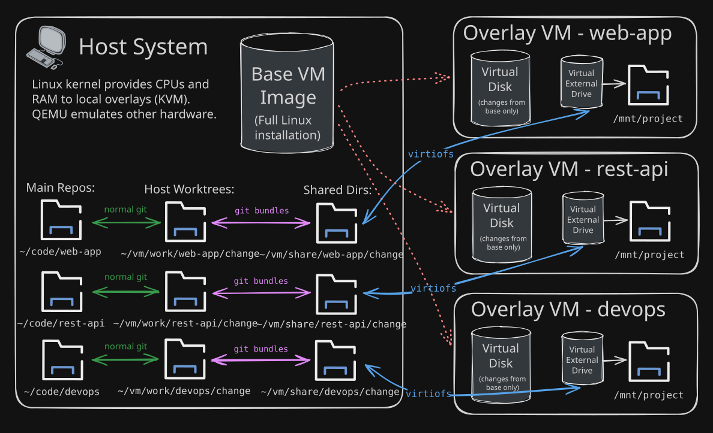

<!-- _class: lead -->
<!-- _paginate: false -->

# Scott Morse


<div class="link-list">

**GitHub**: [https://github.com/ScottMorse](https://github.com/ScottMorse)

**pacwich docs**: [https://pacwich.dev](https://pacwich.dev)

**Blog**: [https://smorsic.io/blog](https://smorsic.io/blog)

</div>

<!--
- Introduce self
- Check out pacwich for Monorepo tooling
- See me for holographic stickers after
- Check out my blog
  - It's linked in the pacwich docs
  - OSS releases and engineering philosophy
-->

---

# Linux on Linux

## Local VMs for Sandboxed Workflows

<div class="talk-notes">

[https://github.com/ScottMorse/linux-on-linux-vms-talk](https://github.com/ScottMorse/linux-on-linux-vms-talk)

</div>

---

# Advantages of VMs

A virtual machine provides a **fully separate operating system** that
can act as a development sandbox.

Modern VM tooling is **highly optimized**:

- A VM's instructions can run directly on **real CPU cores** securely
- Resources you allocate are **only used when needed** (CPU, RAM, storage, etc.)

## VMs _vs._ Containers

Containers are _more lightweight_ but _less isolated_.

<!--
- Running local VMs on your machine might be more realistic than you think

- Containers:
  - Share the host system's kernel so an attacker could potentially escalate privileges
  - Note: Docker containers on macOS share a Linux VM under teh hood

- Linux:
  - Native virtualization support in the Kernel
  - similar developer experience
  - The scriptability turned out to be a major advantage for me (more convenient to use)
-->

---

# VM Overlays

An **overlay** is an optimized layer on top of a **base VM image** that
is like a **lightweight clone**.

An overlay:

- Acts like a **separate VM**
- Is **fast** to spin up and tear down
- Is **storage-optimized**: only writes its changes on top of the base system
- Can be given a **dedicated shared filesystem** (host-owned directory acts like a mounted drive)

This can be ideal for development to quickly **spin up pre-setup sandboxes**, potentially **run them in parallel**, and **destroy them when done**.

<!--
Notes:
- No OS installation for an overlay
- Ideal for development sandboxes
-->

---

# My Agentic Development Workflow

## Scripting VM and git operations

I use a personal CLI to:

- Manage named overlays (**create**, **open**, **destroy**, etc.)
- **Share a repo** with the the overlay
- **Sync code changes** to and from the overlay's repo

## Syncing Code Securely

I use **git bundles** to sync code changes from an overlay.

- A **bundle** is a portable pack of commits that can be transferred between repositories
- I avoid directly interacting with the VM-owned repo and **only pull committed source changes**
  (no poisoned git hooks)

---

<!--  -->


<!--
- Main idea of Host Worktrees: this is where I review and test changes host-side
-->

---

# Personal CLI Examples

```bash
$ project state # See state of all projects' worktrees and overlays
$
$ project go pacwich # cd to my main pacwich repo
$
$ # Commands can infer project from cwd
$ project claude # Open Claude session for current project
$ project code # Open IDE for current project
$
$ # VM overaly commands (similar to worktree commands)
$ project vm up my-vm-feature --open # Create and open a fresh VM overlay
$ project vm go my-vm-feature # cd to the host-owned worktree
$
$ # VM commands can infer the overlay from the cwd
$ project vm diff # See git diff between VM and host worktree
$ project vm code # Open IDE for the host-owned worktree
$ project vm pull # Sync code changes from the VM to host's worktree
$ project vm push # Sync code changes to the VM
$
$ project go # cd back to main repo
$ git merge my-vm_pacwich_my-vm-feature # Maybe merge changes from host worktree
$ project vm down my-vm-feature # Tear down the VM overlay
```
